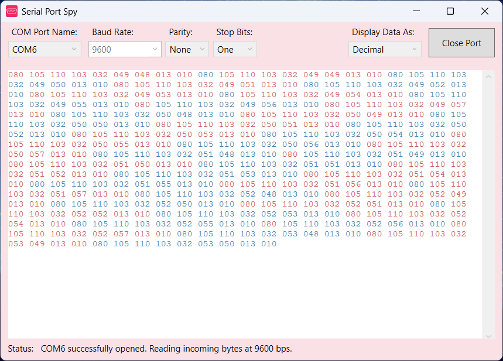

Serial Port Spy
===============

'Serial Port Spy' is a simple application for reading incoming RS232 / serial data, which is being received via a COM Port. A common usage, would be to monitor the data that is being transmitted from a microcontroller (such as an Arduino), for example.  

The application is written in C#/.NET, and can be compiled as a WPF application in Visual Studio 2012. You are free to use this code under a [MIT License](LICENSE).