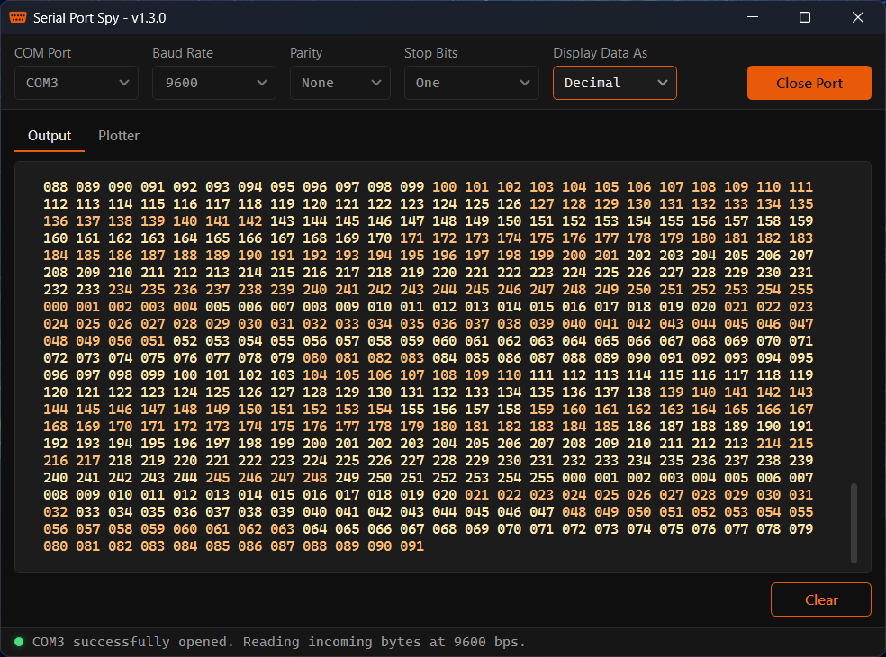

# Serial Port Spy

**Serial Port Spy** is a simple Windows application for reading incoming **RS232 / serial data** received via a **COM port**. A common use case is monitoring data transmitted from a microcontroller, such as an Arduino.

It is currently **read-only** — it listens, and never transmits.

## 🔧 How to Use

1. In the **Releases** section, go to the latest release.
2. Download **SerialPortSpy.zip** and extract it anywhere you like.
3. Run the extracted **SerialPortSpy.exe**.
4. Select the port you wish to read from using the **COM Port** dropdown.
5. Configure **Baud Rate**, **Parity**, and **Stop Bits** to match your device.
6. Choose how to view the data with **Display Data As**.
7. Click **Open Port**.

**Requires 64-bit Windows.** The download is an x64 build and will not run on 32-bit Windows.

There is no installer and nothing to set up — the `.exe` is fully self-contained, so you don't need the .NET runtime installed. It can be run from anywhere, and deleting it uninstalls it.

The app isn't code-signed, so Windows will likely show a **"Windows protected your PC"** dialog the first time you run it. Choose **More info → Run anyway**.

At least one COM port must be present — if none is found on launch, the app says so and exits.

Opening a port clears the log, so each session starts clean. The button then becomes **Close Port**.

The status bar along the bottom reports what happened, alongside a state dot:

| Dot | Meaning |
| --- | --- |
| ⚪ Grey | Idle — no port open |
| 🟢 Green | Port open, reading |
| 🔴 Red | The last open or close attempt failed |

### Baud Rate

The dropdown lists the common rates from **1200** to **2000000**, but the box is also **editable** — type any whole number from 1 to 4,000,000. USB-serial bridges support plenty of rates the list doesn't cover, such as `74880` (ESP8266 boot logs), `250000` (Marlin / DMX512) and `31250` (MIDI).

If what you type isn't a valid rate, **Open Port** greys out and the status bar explains why.

## Display Modes

**Display Data As** controls how incoming bytes are rendered:

- **Text** — for `Serial.println()` output and anything human-readable
- **Decimal** — each byte as a number, `000`–`255`
- **Hex** — each byte as `00`–`FF`, for protocol and binary work

You can switch modes **while the port is open**. The change applies to data arriving after the switch; anything already in the log keeps the format it was captured in.

In Text mode, control bytes are shown as Unicode Control Pictures (`␛` for escape, `␡` for delete) rather than being silently swallowed. These are substitute glyphs, so copying them copies the picture character — **use Hex mode when you need the exact bytes**.

## Serial Settings

Four parameters are configurable: **COM port**, **baud rate**, **parity** and **stop bits**. They are locked while a port is open — close it to change them.

Fixed internally, and not exposed in the UI:

- **8 data bits**
- **No handshake / flow control**

Which makes the common `8-N-1` setup the default: 8 data bits, no parity, one stop bit.

## Technical Details

The application is written in **C# / .NET 10** and built as a **WPF** application. It was compiled using **Visual Studio 2026**. It is currently Windows only (64-bit).

This project is released under the [MIT License](LICENSE).

## ⚠️ Disclaimer

This project is provided "as is" without warranty of any kind. Use at your own risk. The author is not responsible for any damage or data loss resulting from the use of this package. Compatibility and performance may vary depending on your system configuration.
