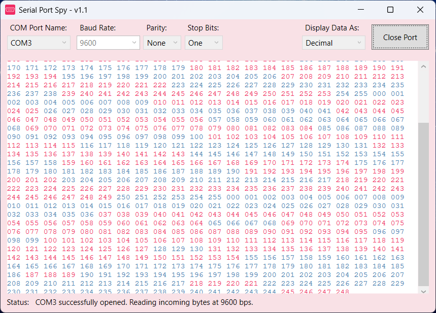

  
  <strong>Serial Port Spy</strong>

# Serial Port Spy

'Serial Port Spy' is a simple application for reading incoming RS232 / serial data, which is being received via a COM Port. A common usage, would be to monitor the data that is being transmitted from a microcontroller (such as an Arduino), for example.  

The application is written in C#/.NET, and can be compiled as a WPF application in Visual Studio 2020. You are free to use this code under a [MIT License](LICENSE).

## Disclaimer
This project is provided "as is" without warranty of any kind. Use at your own risk. The author is not responsible for any damage or data loss resulting from the use of this package. Compatibility and performance may vary depending on your system configuration.